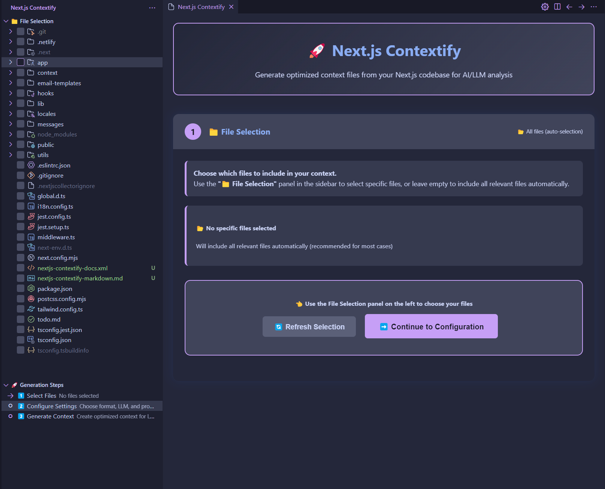
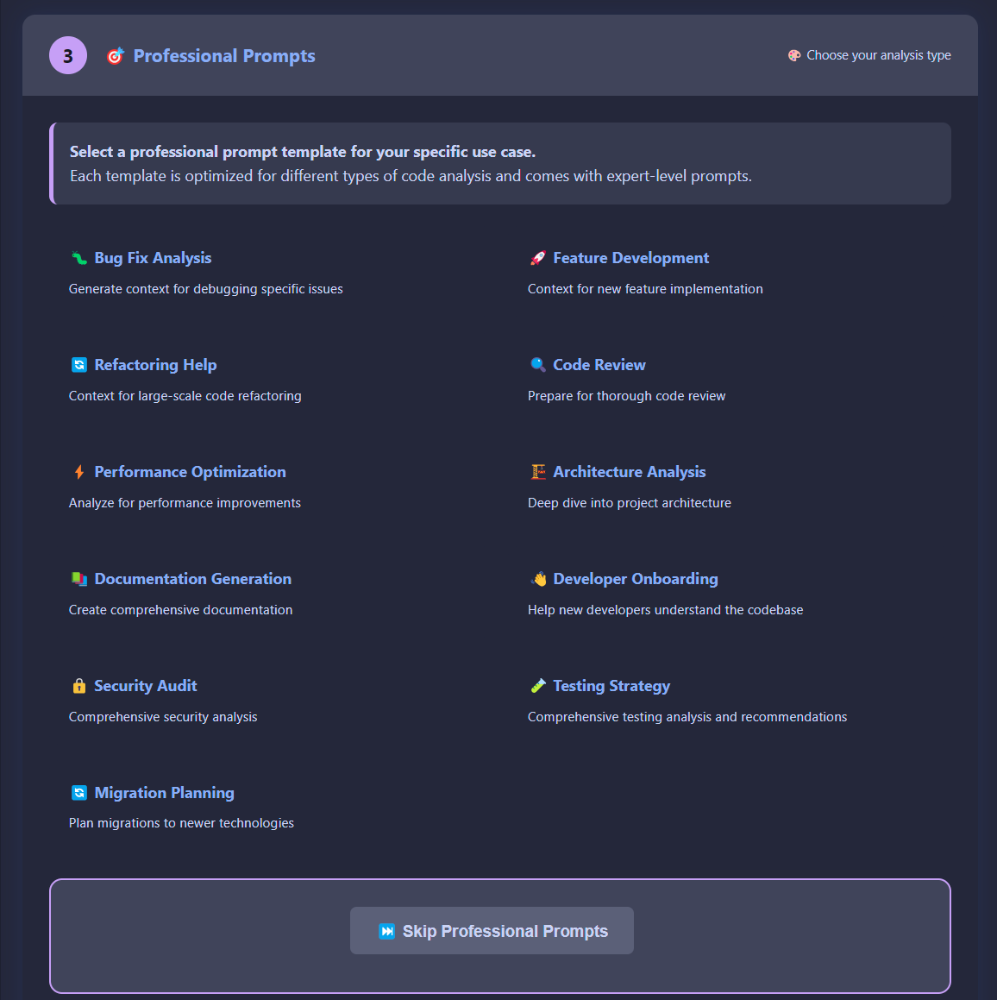
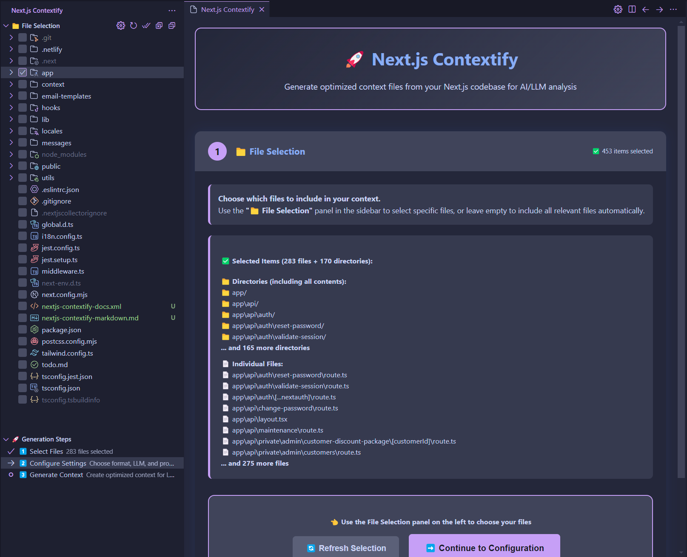
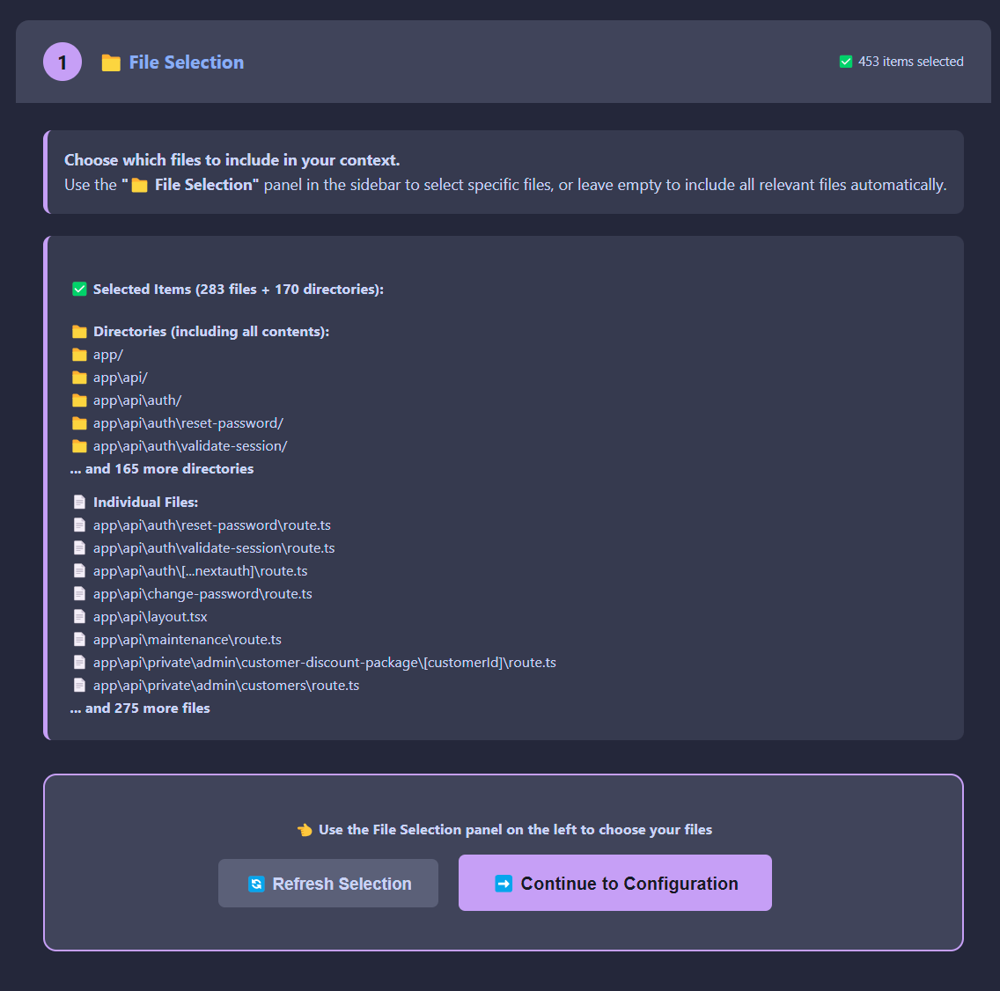
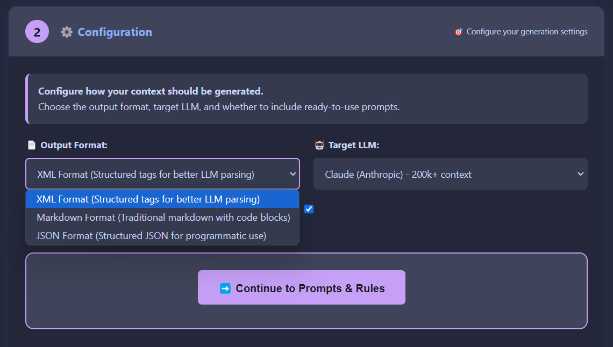
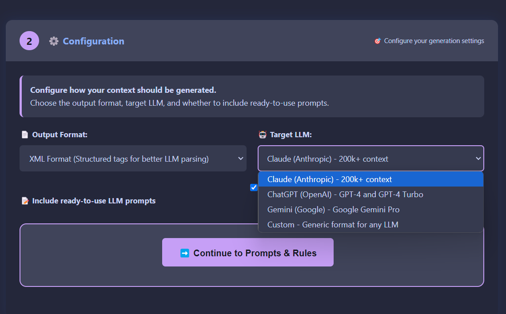
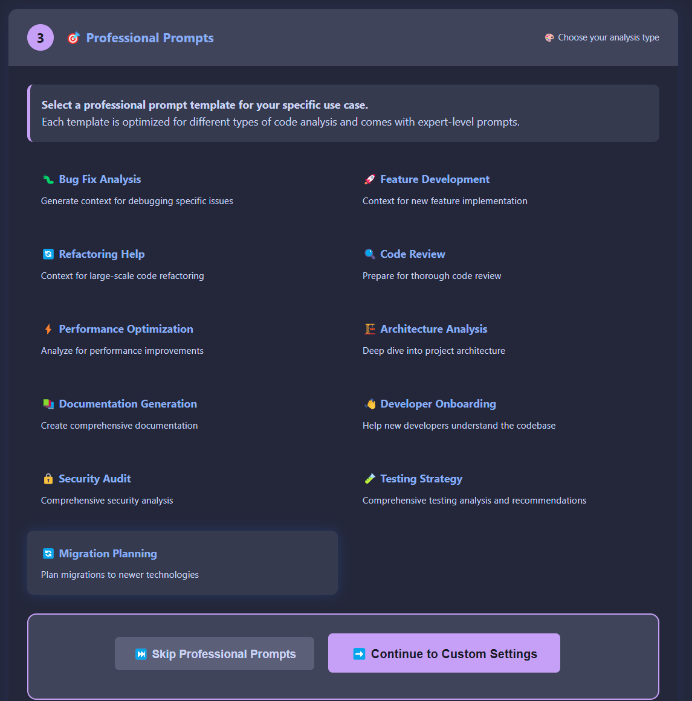
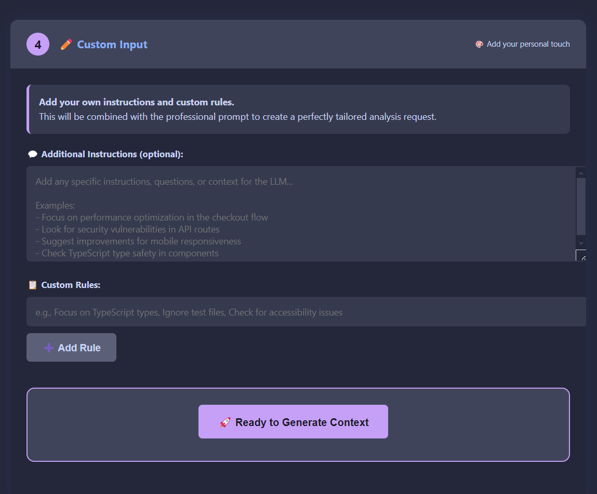

# Next.js Contextify

A powerful VS Code extension that generates comprehensive context files from your Next.js codebase for optimal use with Large Language Models (LLMs) like ChatGPT, Claude, and others.

**🎯 Now with Professional Step-by-Step UI and 12 Expert Prompt Templates!**


*Initial file selection interface with step-by-step guidance and empty selection state*

## 🚀 Features

### 🎨 **Modern Step-by-Step UI**
- **Interactive Step Wizard** - guided 5-step process for perfect context generation
- **Activity Bar Integration** - dedicated panel in VS Code sidebar
- **File Selection Tree** - visual file picker with checkboxes
- **Real-time Progress** - see your progress through each step
- **Professional Templates** - 12 expert-crafted prompt templates

### 🎯 **Professional Prompt Templates**
Choose from 12 specialized templates for different use cases:

#### **Development & Implementation**
- 🐛 **Bug Fix Analysis** - Debug issues and identify problems
- 🚀 **Feature Development** - Plan and implement new features  
- 🔄 **Refactoring Help** - Large-scale code improvements

#### **Analysis & Review**
- 🔍 **Code Review** - Comprehensive code quality analysis
- ⚡ **Performance Optimization** - Speed and efficiency improvements
- 🏗️ **Architecture Analysis** - Deep architectural insights

#### **Documentation & Communication**
- 📚 **Documentation Generation** - Create comprehensive docs
- 👋 **Developer Onboarding** - Help new team members

#### **Specialized Analysis**
- 🔒 **Security Audit** - Security vulnerability assessment
- 🧪 **Testing Strategy** - Testing approach and coverage
- 🔄 **Migration Planning** - Technology migration assistance


*12 expert-crafted prompt templates organized in a clean grid layout for easy selection*

### ✨ **Latest Next.js Support (v15+)**
- **App Router** prioritization with intelligent file categorization
- **Server Components** and **Client Components** detection
- Support for all App Router conventions (`layout`, `page`, `loading`, `error`, `not-found`, `template`, `global-error`)
- **Route Handlers** (`route.ts/js`) detection
- **Middleware** support

### 🎯 **Smart File Prioritization**
Files are intelligently categorized and prioritized for optimal LLM processing:

1. **A: Core Configurations** (Priority 80-100)
   - Next.js config files (`next.config.js/ts/mjs`)
   - Package configuration (`package.json`)
   - TypeScript/JavaScript config
   - Styling configuration (Tailwind, etc.)
   - Middleware

2. **B: App Router Structure** (Priority 60-80)
   - Layouts, pages, loading states
   - Error boundaries and templates
   - API routes in app directory

3. **C: Pages Router Structure** (Priority 68-78)
   - `_app`, `_document`, `_error`
   - API routes in pages directory
   - Custom error pages (404, 500)

4. **D: Components** (Priority 50-55)
   - Client components (`'use client'`)
   - Server components
   - UI components

5. **E: Hooks & Utilities** (Priority 45-48)
   - Custom hooks
   - Utility functions and libraries

6. **F: Data Layer** (Priority 40-42)
   - State management (Redux, Zustand, Context)
   - Database schemas and migrations

7. **G: Styling** (Priority 30-35)
   - Global styles and component styles

8. **H: Other Files** (Priority 10-25)
   - TypeScript/JavaScript files
   - Configuration files
   - Documentation

### 🎨 **Multiple Output Formats**
- **XML Format** - Structured tags for better LLM parsing
- **Markdown Format** - Traditional markdown with code blocks  
- **JSON Format** - Structured data for programmatic use

### 🎯 **Custom User Input**
- **Personal Instructions** - Add your own analysis requirements
- **Custom Rules** - Define specific focus areas
- **Combined Output** - Professional templates + your custom input

### 🛡️ **Enhanced Ignore Patterns**
Comprehensive default ignore patterns for modern Next.js development:

- **Build outputs**: `.next/`, `.swc/`, `out/`, `build/`, `dist/`, `.turbo/`
- **Dependencies**: `node_modules/`
- **Environment**: `.env*` files
- **Lock files**: All package manager lock files (`package-lock.json`, `yarn.lock`, `pnpm-lock.yaml`, `bun.lockb`)
- **Media files**: Images, fonts, audio, video
- **Development tools**: Coverage reports, logs, temporary files
- **AI IDEs**: `.cursor/`, `.windsurf/` configurations

### 📊 **Rich Context Output**
- **Token usage estimation** with LLM-specific limits
- **File statistics** and metadata
- **Progress indicators** during generation
- **Structured output** with categories and priorities

## 🔧 Installation

1. Install from VS Code Marketplace (coming soon)
2. Or install manually:
   ```bash
   git clone https://github.com/sriem/nextjs-contextify
   cd nextjs-contextify
   npm install
   npm run build
   ```

## 📖 Usage

### Step-by-Step UI (Recommended)
1. Open your Next.js project in VS Code
2. Click the **Next.js Contextify** icon in the Activity Bar
3. Follow the 5-step guided process:

#### **Step 1: File Selection**
- Use the **📁 File Selection** panel to choose specific files
- Or leave empty for automatic smart selection
- See real-time file count and selection status


*File selection interface showing 453 selected items with detailed breakdown of directories and individual files*


*Comprehensive view of selected files and directories with expandable lists and item counts*

#### **Step 2: Configuration** 
- Choose output format (XML/Markdown/JSON)
- Select target LLM (Claude/GPT/Gemini/Custom)
- Enable/disable ready-to-use prompts


*Configuration interface with output format selection and target LLM options*


*Dropdown menu showing all available target LLM options including Claude, ChatGPT, Gemini, and Custom*

#### **Step 3: Professional Prompts**
- Browse 12 expert-crafted templates
- Select the one matching your use case
- Or skip for custom-only analysis


*Professional prompts interface with selected Migration Planning template and continue option*

#### **Step 4: Custom Input**
- Add your specific instructions
- Define custom analysis rules
- Combine with professional templates


*Custom input step allowing personal instructions and custom rules for tailored analysis*

#### **Step 5: Generate**
- Generate your optimized context file
- Copy directly to clipboard
- View token usage statistics

### Quick Generation (Command Palette)
- **Next.js Contextify: Quick Generate** - Fast XML generation with defaults
- **Next.js Contextify: Generate Context** - Classic step-by-step wizard
- **Next.js Contextify: Generate with LLM Prompts** - Quick prompt selection

### Custom Ignore Patterns
Create a `.nextjscollectorignore` file in your project root:

```
# Custom ignore patterns
*.test.ts
*.spec.js
/cypress/
/playwright/
custom-folder/
specific-file.ts
```

## 🎯 Perfect for LLM Interactions

### Professional Use Cases
- **🐛 Debugging** - Get expert help finding and fixing bugs
- **🚀 Feature Development** - Plan new features with architectural guidance  
- **📚 Documentation** - Generate comprehensive project documentation
- **🔍 Code Reviews** - Thorough analysis with specific recommendations
- **⚡ Performance** - Identify optimization opportunities
- **🔒 Security** - Vulnerability assessment and fixes
- **🧪 Testing** - Improve test coverage and strategy
- **🔄 Migrations** - Plan technology upgrades and migrations

### Output Examples
Generated files include:
- **Context**: Prioritized file contents with metadata
- **Professional Prompts**: Expert-level analysis requests
- **Token Estimates**: LLM-specific usage calculations
- **Project Structure**: Visual directory tree
- **Instructions**: Ready-to-paste LLM prompts

## 🔄 Recent Updates (v2.1.1)

### 🐛 **Critical Bug Fixes**
- **🔧 Parent-Child Selection Fix** - Fixed child directories not being deselected when parent is deselected
- **📁 Recursive Directory Handling** - Improved recursive selection/deselection of nested directories
- **🔄 Tree View Synchronization** - Better checkbox state management for directory hierarchies
- **📊 Enhanced Logging** - Better debugging for directory selection operations

### 🔄 Previous Updates (v2.1.0)
- **🔧 Selection Sync Fix** - Fixed UI not updating when all files are deselected
- **✅ Empty State Handling** - Proper "no files selected" display when selection is cleared
- **🔄 Event Propagation** - Improved event handling between Tree View and UI

## 🛠️ Development

### Prerequisites
- Node.js 18+
- VS Code 1.85.0+

### Setup
```bash
git clone https://github.com/sriem/nextjs-contextify
cd nextjs-contextify
npm install
```

### Build
```bash
npm run build
```

### Watch Mode
```bash
npm run watch
```

### Package
```bash
npm run vscode:prepublish
```

## 🎯 Professional Prompt Templates Detail

### Development & Implementation
- **🐛 Bug Fix Analysis**: Systematic debugging approach with root cause analysis
- **🚀 Feature Development**: Architectural planning for new features
- **🔄 Refactoring Help**: Strategic code improvement and modernization

### Analysis & Review  
- **🔍 Code Review**: Comprehensive quality assessment with SOLID principles
- **⚡ Performance Optimization**: Core Web Vitals and rendering optimization
- **🏗️ Architecture Analysis**: Scalability and maintainability evaluation

### Documentation & Communication
- **📚 Documentation Generation**: Professional README, API docs, and guides
- **👋 Developer Onboarding**: Team integration and knowledge transfer

### Specialized Analysis
- **🔒 Security Audit**: OWASP Top 10 compliance and vulnerability assessment
- **🧪 Testing Strategy**: Test pyramid approach and quality gates
- **🔄 Migration Planning**: Technology upgrade roadmaps and risk assessment

## 🤝 Contributing

Contributions are welcome! Please feel free to submit a Pull Request.

### Development Guidelines
- Follow TypeScript best practices
- Maintain comprehensive test coverage
- Update documentation for new features
- Ensure compatibility with latest Next.js versions

## 📋 Requirements

- VS Code 1.85.0 or higher
- Next.js project (works with any version, optimized for 13+)

## 🐛 Known Issues

- Very large codebases (10,000+ files) may take longer to process
- Binary files are automatically skipped to prevent corruption

## 📈 Roadmap

- [ ] VS Code Marketplace publishing
- [ ] Custom prompt template creation
- [ ] Real-time context updates
- [ ] Integration with popular AI coding assistants
- [ ] Project template detection
- [ ] Performance metrics and insights
- [ ] Team collaboration features
- [ ] Custom file categorization rules

## 📄 License

MIT License - see [LICENSE](LICENSE) file for details.

## 👤 Author

**Sergej Riemann**
- GitHub: [@sriem](https://github.com/sriem)
- Website: [www.sergej-riemann.dev](https://www.sergej-riemann.dev)

## 🙏 Acknowledgments

- Next.js team for the amazing framework
- VS Code team for the excellent extension API
- The developer community for feedback and contributions
- AI/LLM providers for inspiring better developer tools

---

**⭐ Star this repo if you find it helpful!**

*Transform your Next.js codebase into AI-ready context with professional prompts and intelligent analysis.*